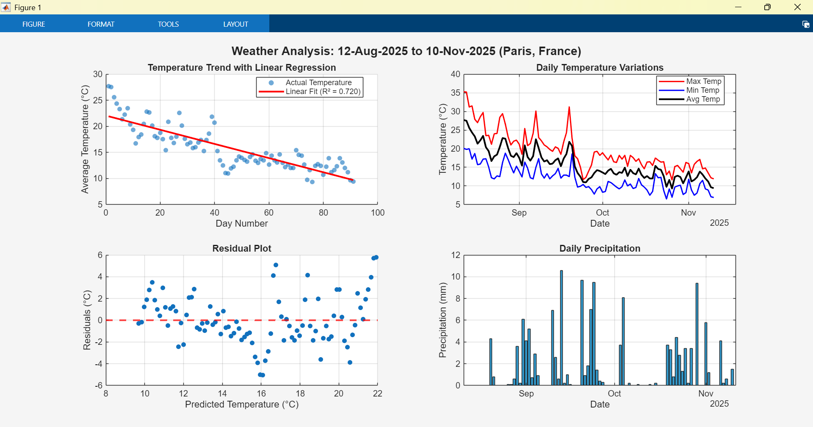

# MATLAB MCP Core Server Integration Guide

> Integrate MATLAB seamlessly into agentic AI workflows (VS Code GitHub Copilot MCP, Claude Code, Claude Desktop, others) without copy/paste loops.

## Overview
The MATLAB MCP Core Server is a local Model Context Protocol (MCP) server that lets AI coding agents start MATLAB, inspect the environment, run scripts, analyze code quality, and execute tests securely within defined folders. Instead of copying generated code manually between a chat and MATLAB, the server exposes focused tools that your AI client can invoke directly.

## Demos

### Claude Desktop
- [weather_linear_regression.m](claude/weather_linear_regression.m) - Simple linear regression script


### VS Code GitHub Copilot
- [weather_regression_app.m](vscode/weather_regression_app.m) - Interactive GUI for analyzing weather trends with linear regression
  - Features: Multi-city selection, date range picker, live regression analysis, interactive plots
  - Uses Open-Meteo API for historical weather data
  - Displays R² score, temperature trends, and precipitation analysis
  
#### Chat Prompts Viewer
- [chat_prompts_app.m](vscode/chat_prompts_app.m) - Small UI to browse all user prompts from a chat export JSON
  - Defaults to `chats/chat_weather_app.json` in this repo
  - Filter by substring, click to preview, double-click to copy to clipboard

## Key Features
- Launch and shut down a local MATLAB session on demand.
- Execute ad‑hoc MATLAB statements or full script files.
- Run unit test scripts and capture structured results.
- Static code analysis for style, potential errors, and performance hints (non‑destructive).
- Enumerate installed toolboxes with version metadata.
- Configurable startup working folder and MATLAB root.
- Optional telemetry (fully anonymized) with a simple opt‑out switch.

## Requirements
- Licensed local MATLAB R2020b or later, added to your system PATH (so the server can locate it unless you specify `--matlab-root`).
- One or more AI agent clients that support MCP (e.g. GitHub Copilot in VS Code, Claude Code CLI, Claude Desktop). 
- OS: Windows, macOS, or Linux. macOS/Linux require executable permission on the downloaded binary.
- (Optional) Go toolchain if you prefer building from source.

## Installation
### 1. Download Prebuilt Binary
Go to the latest release: https://github.com/matlab/matlab-mcp-core-server/releases/latest
Download the binary matching your platform and place it somewhere accessible (e.g. `C:\Tools\matlab-mcp-core-server\matlab-mcp-core-server.exe` on Windows).

### 2. Make Executable (macOS/Linux only)
```bash
chmod +x ~/Downloads/matlab-mcp-core-server
```

### 3. (Optional) Build From Source (Go >=1.22)
```bash
go install github.com/matlab/matlab-mcp-core-server/cmd/matlab-mcp-core-server@latest
```
The resulting binary will be in your `GOBIN` (typically `~/go/bin`).

### 4. Verify MATLAB Availability
On Windows (cmd):
```cmd
where matlab
matlab -batch "disp(version)"
```
If not found, either add MATLAB to PATH or plan to use `--matlab-root`.

## Configuration Examples
Below are three common client setups. Adjust paths for your system.

### GitHub Copilot in VS Code (`mcp.json`)
Create or edit a file `mcp.json` at the workspace root:
```json
{
  "servers": {
    "matlab": {
      "type": "stdio",
      "command": "C:/Tools/matlab-mcp-core-server/matlab-mcp-core-server.exe",
      "args": [
        "--initial-working-folder=C:/Users/YourName/Documents/MATLAB",
        "--disable-telemetry=true"
      ]
    }
  }
}
```
Restart VS Code or reload window for Copilot to pick it up.

### Claude Code CLI
```cmd
claude mcp add --transport stdio matlab C:\Tools\matlab-mcp-core-server\matlab-mcp-core-server.exe --initial-working-folder=C:\Users\YourName\Documents\MATLAB
```
Later removal:
```cmd
claude mcp remove matlab
```

### Claude Desktop JSON Config
In your Claude Desktop configuration file (e.g. on Windows `%APPDATA%\Claude\config.json`):
```json
{
  "mcpServers": {
    "filesystem": {
      "command": "npx",
      "args": [
        "-y",
        "@modelcontextprotocol/server-filesystem",
        "C:/Users/YourName"
      ]
    },
    "matlab": {
      "command": "C:/Tools/matlab-mcp-core-server/matlab-mcp-core-server.exe",
      "args": [
        "--initial-working-folder=C:/Users/YourName/Documents/MATLAB",
        "--disable-telemetry=true"
      ]
    }
  }
}
```
Restart Claude Desktop after saving.

## Server Arguments
| Argument | Purpose | Example |
|----------|---------|---------|
| `--matlab-root=<path>` | Explicitly point to a MATLAB installation if not on PATH. Exclude the `/bin` or `\bin\win64` subfolder. | `--matlab-root=C:\Program Files\MATLAB\R2025a` |
| `--initial-working-folder=<path>` | Sets MATLAB starting directory and location for generated helper scripts. | `--initial-working-folder=C:\Users\YourName\Documents\MATLAB` |
| `--disable-telemetry=true` | Disables fully anonymized usage metrics collection. | `--disable-telemetry=true` |

Omit arguments for defaults (first MATLAB on PATH, standard user documents folder, telemetry enabled).

## Tools Reference
Each tool enforces absolute paths within allowed folders for safety.

### 1. `detect_matlab_toolboxes`
Lists installed toolboxes and versions. Use to confirm required products before generating code that relies on them.

### 2. `check_matlab_code`
Static analyzer; returns warnings about style, deprecated functions, performance concerns, and potential errors without executing the file.
Input: `script_path` → absolute path to a `.m` file.
Typical use: Ask the agent to review a script before running for early feedback.

### 3. `evaluate_matlab_code`
Executes inline MATLAB statements and returns command window output.
Inputs: `code` (string), optionally `project_path` to change working folder first.
Good for quick exploratory snippets or variable inspections.

### 4. `run_matlab_file`
Runs a MATLAB script file (.m) with its own context.
Input: `script_path` absolute path. Ensures reproducibility vs ad‑hoc evaluation.

### 5. `run_matlab_test_file`
Executes a MATLAB test script leveraging MATLAB unit testing framework; returns structured test results for AI reasoning about failures.
Input: `script_path` absolute path to test file.

## Quick Start (VS Code Copilot Example)
1. Install MATLAB and download the server binary.
2. Add `mcp.json` configuration (see earlier snippet).
3. Open a MATLAB project folder in VS Code.
4. In a Copilot chat: “List my installed MATLAB toolboxes.” → Copilot invokes `detect_matlab_toolboxes`.
5. “Analyze `myFunction.m` for potential issues.” → Copilot chooses `check_matlab_code`.
6. “Run `main.m`.” → Copilot invokes `run_matlab_file` and streams output.
7. “Run tests in `tests/testAlgorithm.m`.” → Copilot invokes `run_matlab_test_file`.

## Example Agent Workflow (Claude Desktop)
Prompt: *"Create and run a linear regression example in MATLAB."*
1. Model generates code.
2. Client decides to execute via `evaluate_matlab_code` for quick iteration.
3. If stable, agent writes to a file and uses `run_matlab_file`.
4. Agent suggests creating a test; user prompts for test scaffold; agent saves `tests/testRegression.m` and calls `run_matlab_test_file`.
5. Before committing, agent applies `check_matlab_code` for style & potential performance tweaks.

## Telemetry & Privacy
The server may send anonymized usage metrics to MathWorks to guide improvements (no personal or code content). Disable with `--disable-telemetry=true`. Review MathWorks privacy policies if required by corporate compliance.

## Security & Safety Considerations
- Scope file access using working folders; avoid pointing at sensitive directories.
- Generated code can execute; validate tool calls before approving autonomous actions.
- Keep MATLAB updated with security patches.
- Consider version pinning (use `--matlab-root`) for consistent behavior across team members.

## Troubleshooting
| Issue | Symptom | Resolution |
|-------|---------|------------|
| MATLAB not on PATH | Server fails to start / cannot locate MATLAB | Add MATLAB to PATH or use `--matlab-root` argument. |
| Permission denied (macOS/Linux) | Binary won’t run | Apply `chmod +x` to the downloaded file. |
| Incorrect script path | Tool returns path error | Use absolute path inside allowed working directories. |
| Firewall restrictions | Client cannot connect | MCP uses stdio locally; typically no firewall config needed. Ensure no wrapper blocking execution. |
| Telemetry concerns | Need to disable data collection | Include `--disable-telemetry=true`. |
| Hanging MATLAB session | Tools stop responding | Terminate MATLAB process; restart server. Check for long‑running scripts. |
| Toolbox missing | Errors on using functions | Run `detect_matlab_toolboxes` to verify; install needed toolbox via MATLAB installer. |

## Build From Source (Detailed)
1. Install Go.
2. Fetch and build:
```bash
go install github.com/matlab/matlab-mcp-core-server/cmd/matlab-mcp-core-server@latest
```
3. Confirm:
```bash
matlab-mcp-core-server --help
```
4. Update client configurations to point to the built binary.

## Next Steps / Ideas
- Add CI script to verify basic server invocation.
- Create sample MATLAB project (`examples/linear_regression.m`).
- Add test file template illustrating `run_matlab_test_file` usage.
- Explore advanced flags (future versions) for session persistence or memory profiling.

## References & Links
- GitHub Repository: https://github.com/matlab/matlab-mcp-core-server
- Blog Announcement: https://blogs.mathworks.com/deep-learning/2025/11/03/releasing-the-matlab-mcp-core-server-on-github/
- MATLAB Installation Guide: https://www.mathworks.com/help/install/ug/install-products-with-internet-connection.html
- MCP General Docs: https://modelcontextprotocol.io/
- Copilot MCP Servers: https://code.visualstudio.com/docs/copilot/customization/mcp-servers
- Claude Code MCP: https://docs.claude.com/en/docs/claude-code/mcp

---
© 2025 The MathWorks, Inc. BSD-3-Clause license applies where indicated in the original server repository.
